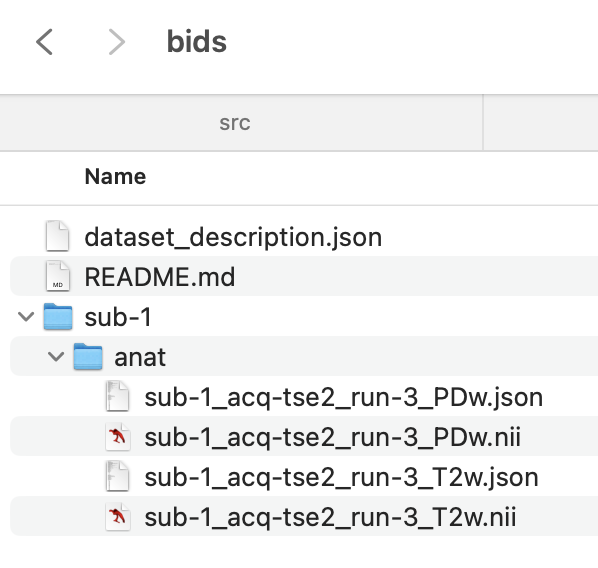

## About

**The BidsGuess feature is intended for wrapper developers only and should not be used in isolation of a wrapper**

dcm2niix version v1.0.20230731 and later will insert the field `BidsGuess` into the [BIDS](https://bids-specification.readthedocs.io/en/stable/) JSON sidecar files. This experimental feature is designed to aid wrappers that use dcm2niix to create BIDS compatible datasets. BIDS aids reproducible, reusable and automatic analysis of neuroimaging data.  This feature was inspired by the automatic BIDS conversion wrappers [niix2bids](https://github.com/benoitberanger/niix2bids) and [ezBIDS](https://brainlife.io/ezbids/). The `BidsGuess` field can be leveraged by wrappers to fully automate conversion (though this will likely require a ezBIDS style user validation) or to flag improbable naming from user configuration files.

## Compiling the development branch

The BidsGuess feature is currently only available in the development branch, so you will need to comile and run this version (v1.0.20230731 and later).

```
git clone --branch development https://github.com/rordenlab/dcm2niix.git
cd dcm2niix/console
make
./dcm2niix
```

## A concrete example

The BidsGuess feature is designed to be leveraged by dcm2niix wrappers, and not used to directly create BIDS format files. Specifically, bidsGuess converts each DICOM series in isolation, and has no information about the user intention. Therefore, it is unable to resolve fieldmap [IntendedFor](https://bids-specification.readthedocs.io/en/stable/04-modality-specific-files/01-magnetic-resonance-imaging-data.html#using-intendedfor-metadata), unable to distinguish fMRI tasks from resting state, BIDS subject ID, BIDS session number, or create meaningful [dataset_description](https://bids-specification.readthedocs.io/en/stable/glossary.html#dataset_description-files) or [readme](https://bids-specification.readthedocs.io/en/stable/glossary.html#readme-files) files.

For the developers of wrappers, you can use the hazardous file naming argument (`-f $h`) to create a minimal BIDS structure for the [bids-validator](https://github.com/bids-standard/bids-validator). Note that this mode will always claim that the data is from `sub-1` and that data is only from a single session. Here is a simple example:

```
cd ~
mkdir bids
git clone git@github.com:neurolabusc/dcm_qa_pdt2.git
dcm2niix -f %h -w 1 -i y -o ~/bids ~/dcm_qa_pdt2
bids-validator ~/bids
```
You can see that the bids-validator is happy with the results and that the data appears organized correctly:



Inspecting the JSON files, we can see that dcm2niix has suggested a likely <[datatype](https://bids-specification.readthedocs.io/en/stable/schema/index.html#bids-filenames)> (`anat`) and <[entities](https://bids-specification.readthedocs.io/en/stable/schema/index.html#bids-filenames)>.

```
	"BidsGuess": ["anat","_acq-tse2_run-3_PDw"],
	"BidsGuess": ["anat","_acq-tse2_run-3_T2w"],
```

Developers can use the `hazardous` file naming to validate and extend the modality detection. However, production quality wrappers should use the `BidsGuess` in the JSON file combined by a file naming scheme that avoids name clashes between different participants and sessions (e.g. one can segment data by datetime, series and protocol name with `-f %t/%s_%p`).

## The acq entity

The `BidsGuess` creates a meaningful [`_acq-` entity](https://bids-specification.readthedocs.io/en/stable/appendices/entities.html#acq) that can provide consistency across wrappers, minimizes the risk of naming clashes and allows users to quickly detect sequence details. The first part of this reveals the manufacturer's name for the sequence. For example, a Siemens 2D turbo spin-echo will report `tse2`, while a 2D echo-planar spin-echo will report `epse2` and a 3D turbo flash will report `tfl3`. If acceleration was used, this will be reported next. For example, a 2D echo-planar gradient-echo with x3 in-plane and x4 mult-iband acceleration would be reported as `epfid2p3m4`.

## The run entity

The `BidsGuess` will typically include a [`_run-` entity](https://bids-specification.readthedocs.io/en/stable/appendices/entities.html#run) that reports the DICOM series number of an image. This is often useful for determining the temporal order of images (e.g. if the first attempt to acquire the data was due to head motion). This entity also avoids naming clashes. Note that wrapper developers may want to remove this entity from the BIDS guess - it is redundant with the `SeriesNumber` stored in the sidecar JSON. Finally, dcm2niix will not append a `_run` entity for fieldmaps: the BIDS validation tool expects that the different images associated with a fieldmap have identical file names except the suffix (e.g. `magnitude1` and `phasediff`).

## The dir entity

The `BidsGuess` will typically include a [`_dir-` entity](https://bids-specification.readthedocs.io/en/stable/appendices/entities.html#dir) for modalities when required by the BIDS validator. This field is redunant with the JSON `PhaseEncodingDirection` field. Note that the JSON uses the values `j`, `j-`, `k` and `k-` to specify row versus column and polarity. In contrast, the BidsGuess will use the `AP`, `PA`, `LR`, and `RL` tags though note these tags will only be correct for axial acquisitions. Note that it is impossible to infer phase encoding polarity for Philips data, so this entity will not be populated leading to errors from the bids-validator.

## Limitations

This feature is very experimental, and is currently provided to get feedback from wrapper developers and to get community support to enhance the guessing accuracy.

 - This feature currently only supports images from GE, Philips and Siemens MR scanners.
 - Multi-Echo MP-RAGE where individual echos (rather than mean) are saved will include the [_echo](https://bids-specification.readthedocs.io/en/stable/appendices/entities.html#echo) entity to distinguish them, e.g. `_acq-tflme3p2_run-5_echo-2_T1w`, `_acq-tflme3p2_run-5_echo-1_T1w`. This will [cause issues](https://github.com/bids-standard/bids-specification/issues/654) with the current bids-validator.
 - ASL datasets will generate errors with the bids-validator. The ASL BEP introduced many required tags for converted data without explaining how these are determined or even if they exist in the core DICOM images. The validation dataset [only provides the desired BIDS translation and not the source DICOMs](https://osf.io/yru2q/).
 - Philips DICOMs are underspecified for BIDS conversion. Beyond the previously noted issue with phaseEncodingDirection, the `SliceTiming` is also unknown. This is a limitation of Philips DICOM, not dcm2niix.
